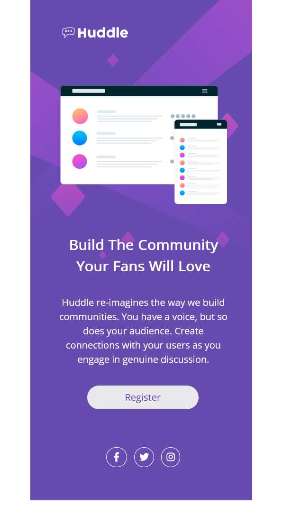
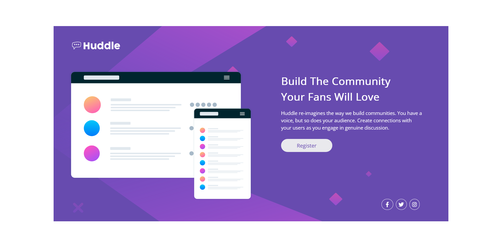

# Frontend Mentor - Huddle landing page with single introductory section solution

This is a solution to the [Huddle landing page with single introductory section challenge on Frontend Mentor](https://www.frontendmentor.io/challenges/huddle-landing-page-with-a-single-introductory-section-B_2Wvxgi0). Frontend Mentor challenges help you improve your coding skills by building realistic projects. 

## Table of contents

- [Overview](#overview)
  - [The challenge](#the-challenge)
  - [Screenshot](#screenshot)
  - [Links](#links)
- [My process](#my-process)
  - [Built with](#built-with)
  - [What I learned](#what-i-learned)
  - [Continued development](#continued-development)
  - [Useful resources](#useful-resources)
- [Author](#author)


## Overview

### The challenge

Users should be able to:

- View the optimal layout for the page depending on their device's screen size
- See hover states for all interactive elements on the page

### Screenshot




### Links

- Solution URL: [My Solution](https://github.com/shashikantdev3/FrontendMentor-huddle-landing-page-with-single-introductory-section-master)
- Live Site URL: [Live Preview](https://shashikantdev3.github.io/FrontendMentor-huddle-landing-page-with-single-introductory-section-master/)

## My process

### Built with

- Semantic HTML5 markup
- CSS custom properties
- Flexbox
- CSS Grid
- Mobile-first workflow

### What I learned

In this ptoject I learned about the background-size property to adjust the background image, Here I have given the different backround size for different screen. see below code.

```html
 <div class="huddle">
            
      <div class="upper">
        <div class="huddle__logo">
          
        </div>
  
        <div class="huddle__mockups">
          
        </div>
      </div>
```
```css

.huddle{
    display: flex;
    flex-direction: column;
    max-width: 23.4rem;
    background-color: var(--clr-violet);
    background-image: url(./images/bg-mobile.svg); 
    background-repeat: no-repeat;
    background-size: 100% 52%;
}


@media (min-width: 600px) {
    .huddle{
        flex-direction: row;
        min-width: 75.5rem;
        background-image: url(./images/bg-desktop.svg);
        background-repeat: no-repeat;
        background-size: 85% 100%;
        margin-top: 5rem;
    }
}
```


## Author

- Website - [Shashikant](https://www.your-site.com)
- Frontend Mentor - [@shashikantdev3](https://www.frontendmentor.io/profile/shashikantdev3)
- Twitter - [@shashikantdev3](https://www.twitter.com/shashikantdev3)


